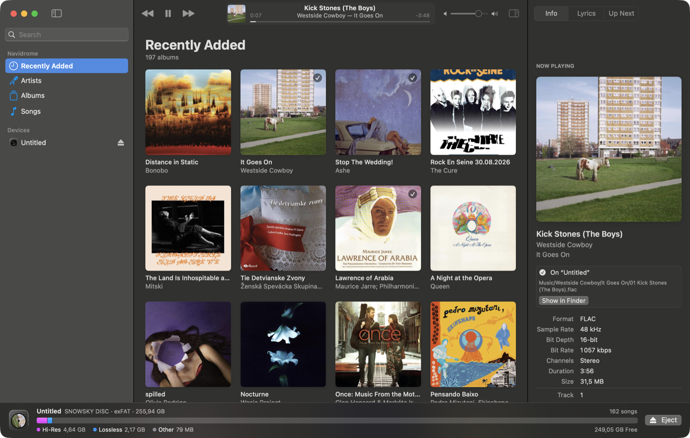
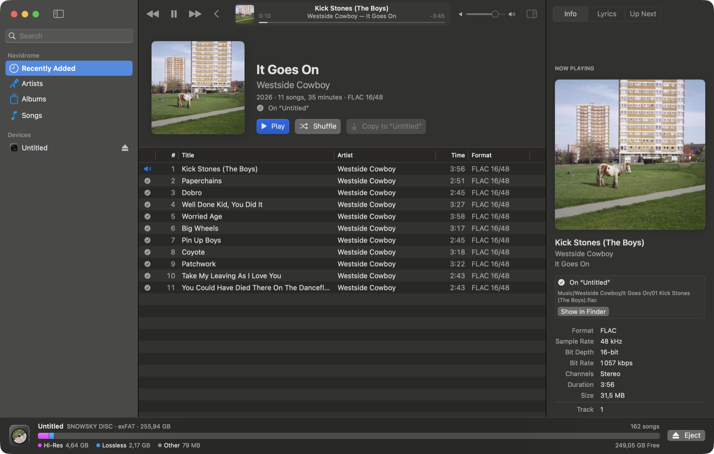
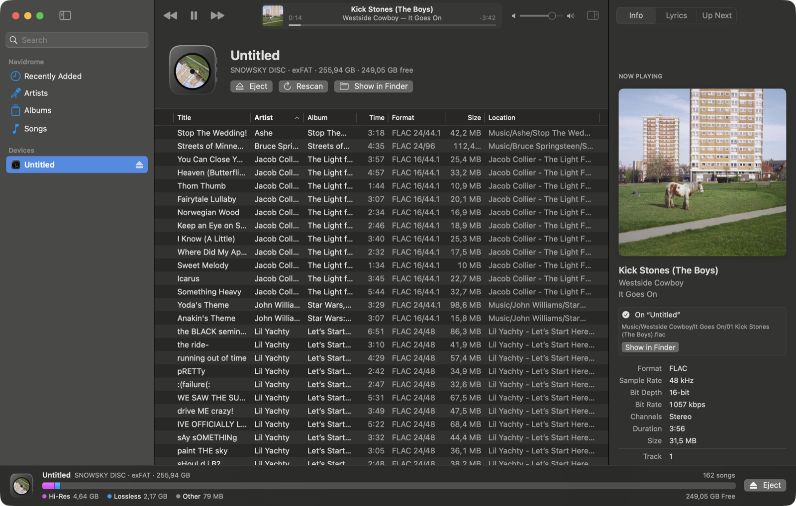
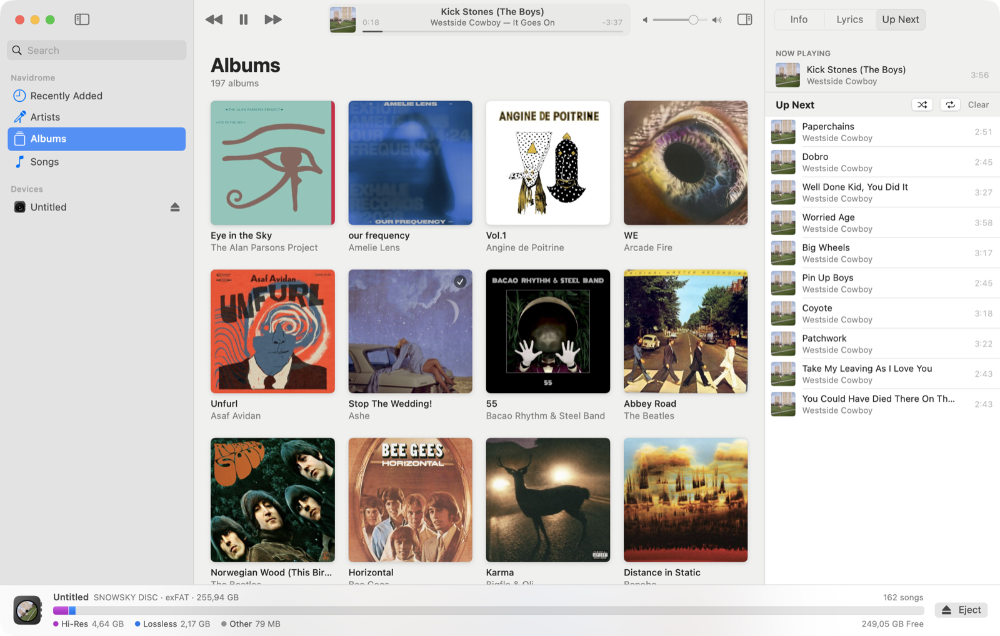

# Discodrome

A music manager for the **FiiO SNOWSKY DISC**, in the spirit of iTunes: your Navidrome library in
the middle, playlists and devices on the left, song info and lyrics on the right, and the player's
storage along the bottom. It is also a gapless music player for the Mac.

Built with SwiftUI and AppKit, no dependencies, and no Xcode required to build it.



<p>
  
  
</p>
<p align="center"><em>Songs already on the DISC are recognised, down to each track, and the card's contents are one click away.</em></p>

## Requirements

- macOS 15 (Sequoia) or later.
- A **Navidrome** server, or any other Subsonic-compatible server (gonic, Airsonic…).
- To build: the Swift toolchain from the Command Line Tools (`xcode-select --install`).

## Install

Download `Discodrome-…-universal.zip` from the [latest release](https://github.com/Frankynov/Discodrome/releases/latest)
— one app for both Apple silicon and Intel Macs — unzip it, and move **Discodrome** to Applications.

The app is ad-hoc signed, not notarized by Apple, so macOS blocks it the first time you open it.
After that first attempt, go to System Settings ▸ Privacy & Security, click **Open Anyway** next to
the message about Discodrome, and confirm. From then on it opens normally.

## Build and run

```bash
./build.sh            # release build → build/Discodrome.app
./build.sh debug      # faster to compile
./build.sh universal  # Apple silicon + Intel
open build/Discodrome.app
```

On first launch, open **Discodrome ▸ Settings… ▸ Server** (⌘,) and enter your server's address,
username and password. The library loads, and is cached so it appears instantly afterwards.

The app is ad-hoc signed. The first time it touches the DISC's card, macOS asks whether it may
access files on a removable volume; because every rebuild changes the ad-hoc signature, macOS may
ask again after you rebuild.

## What it does

### Library



Albums, artists, songs and playlists from the server, with cover art, search, sortable song
columns (right-click a column header to choose columns), and drag and drop. Drop songs on a
playlist in the sidebar to add them to it on the server.

### Player
- **Gapless.** Songs are decoded into one continuous stream on `AVAudioEngine`, so an album's
  tracks join sample for sample. AAC and LAME-tagged MP3 have their encoder padding trimmed.
  The only (tiny) pause is where the sample rate or channel count changes between two songs.
- FLAC and AIFF songs start playing while they download. Decoding stops exactly at the edge of
  what has arrived and picks up from the same sample as more comes in, so a song that starts
  early still joins the next one seamlessly. Other formats (MP3, AAC and ALAC `.m4a`, Opus, WAV)
  and transcoded songs play once fully downloaded: Core Audio can't resume those sample-exactly
  mid-download (for MP3, it couldn't be verified). The next songs download ahead; downloads are
  kept in a size-limited cache (Settings ▸ Playback) that copying to the DISC also reuses.
- Formats macOS can't decode are transcoded to MP3 by the server.
- Media keys, Control Centre and the Lock Screen's Now Playing work; plays are reported back to
  Navidrome after half the song or four minutes.
- Synced lyrics that follow the song (click a line to jump there), Up Next with drag to reorder.
- Shuffle and Repeat live in the Up Next pane and the Controls menu; add them to the toolbar with
  **View ▸ Customize Toolbar…** if you'd rather have them there.

### The SNOWSKY DISC
Plug the DISC in over USB; it mounts as a memory card and appears under **Devices**.

- **The bar at the bottom** shows how the card is used — hi-res, lossless, lossy, other, free —
  and, while copying, the space that's about to be filled (in red if it won't fit).
- **Copy by dragging** songs, albums, artists or playlists onto the device in the sidebar, onto
  the bottom bar, or into the device's page — or use the Copy buttons and context menus.
- **No duplicates.** The card is scanned and every library song that's already there is marked
  (✓ in song lists and on album covers). Discodrome recognises songs it copied itself, byte-for-byte
  identical files, and — marked as “probably on the device” — songs with the same tags copied some
  other way. Those are skipped when you copy.
- **Folders are the interface.** The DISC has no playlists, so songs are organised as
  `Music/Album Artist/Album/01 Title.flac`, with names made safe for FAT/exFAT. The layout is
  configurable in Settings ▸ Device.
- **Lyrics.** When the server has synced lyrics, an `.lrc` file goes next to the song; the DISC
  shows them (firmware 1.65 or later).
- **Formats.** Songs are copied as they are. The DISC plays FLAC, ALAC, WAV, AIFF, APE, DSD, MP3,
  AAC, Ogg Vorbis and WMA; anything else (Opus, for instance) is transcoded to MP3 by the server.
- **Clean cards.** macOS tags every file an app creates with extended attributes, which FAT and
  exFAT can only store as `._` files — and the DISC lists those as broken songs. Discodrome deletes
  them as soon as each song, lyrics file and folder is written, and removes ones left by Finder on
  eject (optional).
- Delete songs from the card with ⌫ in the device's song list.
- **Transfers** on the device's page lists every copy made this session — one section per album or
  selection — with what was copied, what was skipped and what failed.
- The drawing of the DISC shows the cover of what's playing on its round screen, turning slowly
  while it plays, like the player's own display; a ring of light circles it while songs are copied.

The DISC doesn't name itself over USB — it reports a generic “Linux File-Stor Gadget”, like
other Linux-based players — so Discodrome recognises it by that together with the `CustomCover`
folder its firmware keeps on the card (or by a volume name containing SNOWSKY). If it's shown as
a plain card, right-click it under Devices and choose **This Is a SNOWSKY DISC**.

## Keyboard

| | |
|---|---|
| Space | Play / Pause |
| ⌘→ / ⌘← | Next / Previous |
| ⌘↑ / ⌘↓ | Volume |
| ⌘L | Go to the current song |
| ⌘I, ⌥⌘L, ⌥⌘U | Info, Lyrics, Up Next |
| ⌥⌘I | Show or hide the inspector |
| ⇧⌘D | Copy the selection to the device |
| ⌘E | Eject the device |
| ⌘R | Refresh the library |
| Return | Play the selected songs |

## Where things are kept

| | |
|---|---|
| Settings, including the server address, username and **a salted token of your password, unencrypted** | `~/Library/Preferences/com.discodrome.app.plist` |
| Library cache and what's known about each card | `~/Library/Application Support/Discodrome/` |
| Downloaded songs and cover art | `~/Library/Caches/Discodrome/` |

Nothing is stored in the Keychain.

## Development

```bash
./test.sh   # Subsonic client, tag reader, path rules, matching, and gapless rendering
```

`test.sh` exists because SwiftPM, with only the Command Line Tools, doesn't hand the Swift Testing
macro plugin to the compiler. For the same reason the app spells `@State` as `@ViewState` — see
`Sources/Discodrome/UI/ViewState.swift`.

The gapless tests render three FLAC files (and two AAC files) through the real engine into memory
and check that the output is one continuous waveform.

To work without a server or the player:

```bash
python3 Tools/make_fixture_library.py /tmp/discodrome-fixture   # an invented library
python3 Tools/mock_navidrome.py /tmp/discodrome-fixture         # serves it on :4533 (demo / demo)
mkdir -p /tmp/fake-disc
DISCODROME_FAKE_DEVICE=/tmp/fake-disc DISCODROME_DATA_DIR=/tmp/discodrome-data \
  build/Discodrome.app/Contents/MacOS/Discodrome
```

| Variable | Effect |
|---|---|
| `DISCODROME_FAKE_DEVICE=/folder` | presents the folder as a SNOWSKY DISC |
| `DISCODROME_FAKE_DEVICE_CAPACITY_MB=120` | gives that fake card a small capacity, so its usage shows in the bar |
| `DISCODROME_DATA_DIR=/folder` | keeps the library cache, downloads and card manifests out of `~/Library` |
| `DISCODROME_MUTE=1` | plays silently, without changing the saved volume |
| `DISCODROME_SNAPSHOTS=/folder` | walks through the app — albums, an album, playback and lyrics, a track change, the device, a copy, deleting and copying back — logging what it sees and saving a PNG of the window at each step (`DISCODROME_SNAPSHOTS_QUIT=1` quits afterwards; `DISCODROME_SNAPSHOTS_ONLY=stream` instead times songs that are still downloading — how soon they start, the change to the next song, underruns — best against `mock_navidrome.py --throttle-kbs`, with `DISCODROME_STREAM_NATURAL=1` to play on into the next song rather than seek; `DISCODROME_SNAPSHOTS_ONLY=inspector` traces the toolbar while the inspector opens and closes, and counts the display refreshes those animations miss; `DISCODROME_SNAPSHOTS_ONLY=readme` takes the README's pictures against the server the app is set up with, without scrobbling and with the playlists left out) |

`python3 Tools/mock_navidrome.py … --throttle-kbs 1500` slows song downloads, to watch copy
progress. Settings are read from the app's bundle identifier, so a development copy with a
different identifier leaves the real app's preferences alone.

### Layout

- `Sources/DiscodromeCore` — no UI: `Subsonic/` (client), `Playback/` (gapless engine, download
  cache), `Device/` (tag reader, scanner, matcher, path rules), `Model/`.
- `Sources/Discodrome` — the app: `Services/` (library, player, devices, transfers, settings),
  `UI/`, `App/`.
- `Tools/` — icon renderer, fixture library, mock server.
